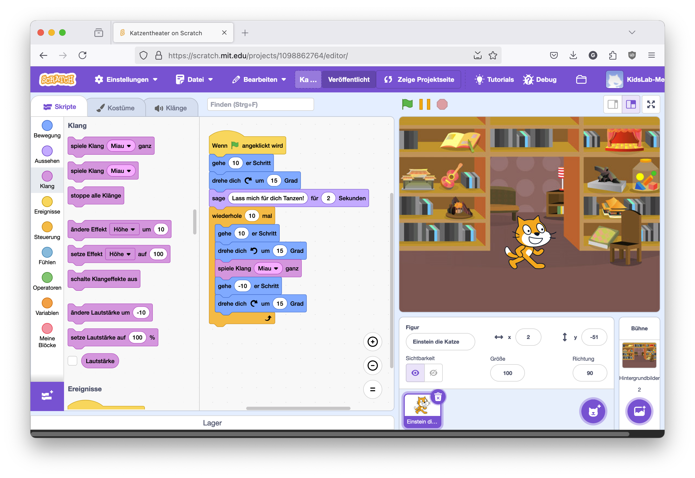
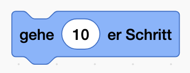
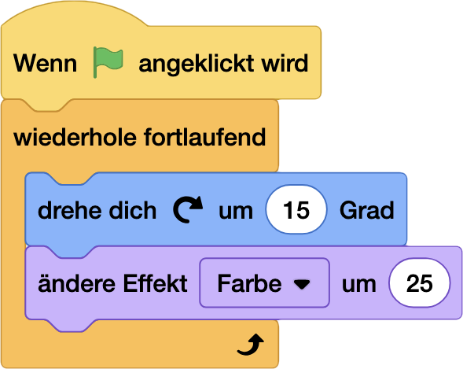
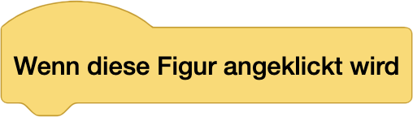
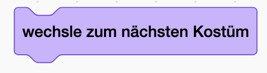

# Movie Director 🎬 [⭐]

> [!TIP]
> ### NerdY Fun-Fact
> Wusstest du? Der erste Animationsfilm der Welt wurde 1908 von Émile Cohl erstellt und hieß "Fantasmagorie". Er bestand aus über 700 einzelnen Zeichnungen, die nacheinander fotografiert wurden! 📽️

### Was du hier lernst

- Die Scratch-Oberfläche kennenlernen
- Figuren und Sprites steuern
- Erste Animationen erstellen
- Mit der Bühne und Kostümen arbeiten

## Die Bühne

- Rechts siehst du die "Bühne" - das ist dein Spielfeld
- Hier bewegen sich deine Figuren und hier passiert die ganze Action
- Die Bühne kannst du auch als Vollbild anzeigen lassen

## Deine Figuren

- Links unten siehst du alle Figuren in deinem Projekt
- Am Anfang ist nur die Scratch-Katze da
- Mit dem "+"-Button kannst du neue Figuren hinzufügen:
  - Fertige Figuren aus der Bibliothek wählen
  - Eigene Figuren malen
  - Bilder von deinem Computer hochladen

## Die Blöcke

- Links in der Mitte findest du alle Befehlsblöcke
- Die Blöcke sind nach Farben sortiert, so findest du sie leichter:
  - Blaue Blöcke für Bewegung
  - Violette Blöcke für Aussehen
  - Gelbe Blöcke für Events (was wann passieren soll)
  - Orange Blöcke für Steuerung

## Dein Programmierbereich

- In der Mitte ist dein Programmierbereich
- Hierhin ziehst du die Blöcke
- Die Blöcke rasten wie Puzzleteile ineinander ein
- Alles was du hier zusammenbaust, bestimmt was deine Figur macht

## Leg los: lass die Katze laufen!

1. Klicke auf die Scratch-Katze
2. Ziehe einen blauen "`gehe 10er-Schritt`"-Block in den Programmierbereich
3. Klicke auf den Block
4. Die Katze bewegt sich!

Und jetzt mach noch ein ganzes Programm draus!

Klicke auf die Grüne Flagge:   

> [!NOTE]
>
> ### Nerdy-Erkläromat
>
> 1. Figuren schnell duplizieren
>    - Rechtsklick auf Figur → Duplizieren
>    - Spart Zeit beim Erstellen ähnlicher Figuren
> 2. Kostüme clever nutzen
>    - Kostüme für verschiedene Zustände
>    - Animation durch Kostümwechsel
>    - Kostüme aus der Bibliothek mixen
> 3. Ordnung im Projekt
>    - Figuren sinnvoll benennen
>    - Blöcke kommentieren
>    - Ähnliche Blöcke gruppieren
>
> 

> [!IMPORTANT]
> ## Nerdy-Side-Quest
> Mach aus der Katze einen Filmstar!
> - füge den Block `wenn auf figur geklickt` und `wechsle zum nächsten kostüm`
>   - 
>   - 
> - Klicke auf die Katze, was passiert?
> - Wechsle im Arbeitsbereich auf `Kostüme` und male etwas auf der Katze rum

---