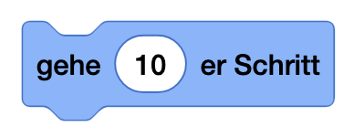

---

# Movie Director 🎬 [⭐]

## Die Bühne

- Rechts siehst du die "Bühne" - das ist dein Spielfeld
- Hier bewegen sich deine Figuren und hier passiert die ganze Action
- Die Bühne kannst du auch als Vollbild anzeigen lassen

## Deine Figuren

- Links unten siehst du alle Figuren in deinem Projekt
- Am Anfang ist nur die Scratch-Katze da
- Mit dem "+"-Button kannst du neue Figuren hinzufügen:
  - Fertige Figuren aus der Bibliothek wählen
  - Eigene Figuren malen
  - Bilder von deinem Computer hochladen

## Die Blöcke

- Links in der Mitte findest du alle Befehlsblöcke
- Die Blöcke sind nach Farben sortiert:
  - Blaue Blöcke für Bewegung
  - Violette Blöcke für Aussehen
  - Gelbe Blöcke für Events (was wann passieren soll)
  - Orange Blöcke für Steuerung

## Dein Programmierbereich

- In der Mitte ist dein Programmierbereich
- Hierhin ziehst du die Blöcke
- Die Blöcke rasten wie Puzzleteile ineinander ein
- Alles was du hier zusammenbaust, bestimmt was deine Figur macht

## Leg los: lass die Katze laufen!

1. Klicke auf die Scratch-Katze
2. Ziehe einen blauen "gehe 10er-Schritt"-Block in den Programmierbereich
3. Klicke auf den Block
4. Die Katze bewegt sich!

Und jetzt mach noch ein ganzes Programm draus!

Klicke auf die Grüne Flagge:   

## Challenge

- füge den Block `wenn auf figur geklickt` und `wechsle zum nächsten kostüm`
  - 
  - 
- Klicke auf die Katze, was passiert?
- Wechsle im Arbeitsbereich auf `Kostüme` und male etwas auf der Katze rum
---

Checkliste:

- [ ] Du kannst deinem Mitschüler erklären, was sich wo im Arbeitsbereich befindet
- [ ] Die Katze dreht sich fleißig im Kreis, wenn du die grüne Flagge klickst
- [ ] Sie ist animiert, wenn man auf sie klickt
- [ ] Du hast der Katze einen Bart, rote Augen oder Eselsohren gemalt 
