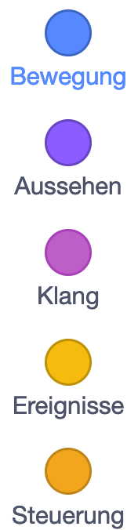

# Level 1 - Movie Director 🎬 [⭐]

> [!TIP]
> **NerdY Fun-Fact**
> **Wusstest du?** Der erste **Animationsfilm** der Welt wurde **1908** von **Émile Cohl** erstellt und hieß "**Fantasmagorie**". Er bestand aus über **700** einzelnen **Zeichnungen**, die nacheinander **fotografiert** wurden! 📽️

### Was du hier lernst

- Die **Scratch-Oberfläche** kennenlernen
- **Figuren** und **Sprites** steuern
- Erste **Animationen** erstellen
- Mit der **Bühne** und **Kostümen** arbeiten

## Die Bühne

- Rechts siehst du die "**Bühne**" - das ist dein **Spielfeld**
- Hier bewegen sich deine **Figuren** und hier passiert die ganze **Action**
- Die **Bühne** kannst du auch als **Vollbild** anzeigen lassen

## Deine Figuren

- Rechts unten siehst du alle **Figuren** in deinem **Projekt**
- Am Anfang ist nur die **Scratch-Katze** da
- Mit dem "+"-Button kannst du neue **Figuren** hinzufügen:
  - Fertige **Figuren** aus der **Bibliothek** wählen
  - Eigene **Figuren** malen
  - **Bilder** von deinem **Computer** hochladen

## Die Blöcke

- Links findest du alle **Befehlsblöcke**

- Die **Blöcke** sind nach **Farben** sortiert, so findest du sie leichter:
  - Blaue **Blöcke** für **Bewegung**
  - Violette **Blöcke** für **Aussehen**
  - Gelbe **Blöcke** für **Events** (was wann passieren soll)
  - Orange **Blöcke** für **Steuerung**
  
  { width=25% }

## Dein Programmierbereich

- In der Mitte ist dein **Programmierbereich**
- Hierhin ziehst du die **Blöcke**
- Die **Blöcke** rasten wie **Puzzleteile** ineinander ein
- Alles was du hier zusammenbaust, bestimmt was deine **Figur** macht

## Leg los: lass die Katze laufen!

1. Klicke auf die **Scratch-Katze**
2. Ziehe einen blauen "`gehe 10er-Schritt`"-**Block** in den **Programmierbereich**
3. Klicke auf den **Block**
4. Die **Katze** bewegt sich!

{ width=25% }

Und jetzt mach noch ein ganzes **Programm** draus!

{ width=25% }

Klicke auf die **Grüne Flagge**: 

> [!NOTE]
>
> **Nerdy-Erkläromat**
>
> 1. **Figuren** schnell duplizieren
>    - Rechtsklick auf **Figur** → **Duplizieren**
>    - Spart Zeit beim Erstellen ähnlicher **Figuren**
> 2. **Kostüme** clever nutzen
>    - **Kostüme** für verschiedene Zustände
>    - **Animation** durch **Kostümwechsel**
>    - **Kostüme** aus der Bibliothek mixen
> 3. **Ordnung** im Projekt
>    - **Figuren** sinnvoll benennen
>    - **Blöcke** kommentieren
>    - Ähnliche **Blöcke** gruppieren
>
> 

> [!IMPORTANT]
> 
>  **Nerdy-Side-Quest**
> 
> Mach aus der **Katze** einen **Filmstar**!
> 
> 1. füge den **Block** `wenn auf figur geklickt` und `wechsle zum nächsten kostüm`
>   - { width=25% }
>   - { width=25% }
> 2. Klicke auf die **Katze**, was passiert?
> 3. Wechsle im **Arbeitsbereich** auf `Kostüme` und male etwas auf der **Katze** rum

### Entdecke mehr! 📱

Weitere Beispiele und coole fertige Scratch-Filme findest du hier:

\newpage