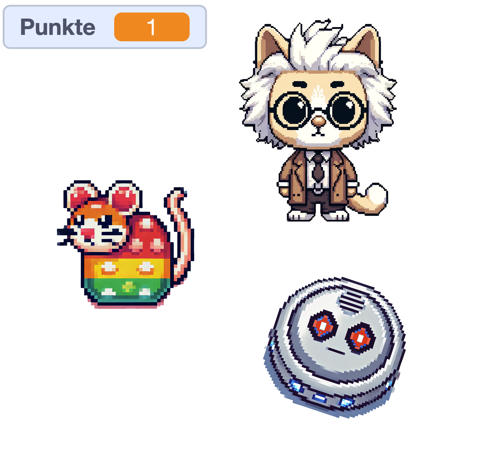
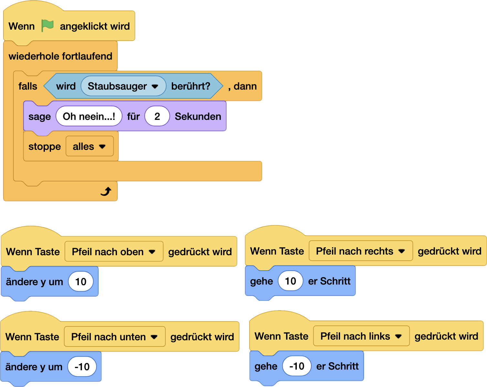
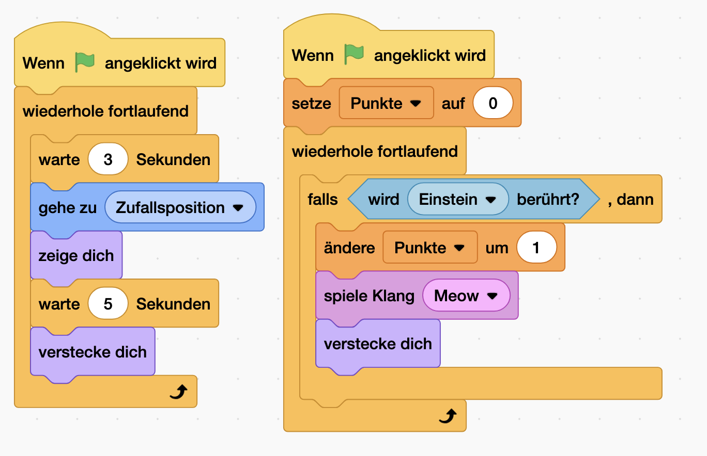
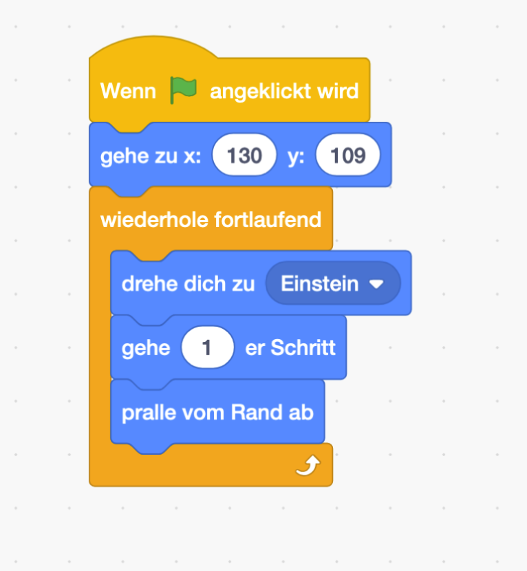

# Katzen Freund 😺 [⭐]

### NerdY Fun-Fact

Wusstest du? Der erste digitale Staubsauger-Roboter wurde 2002 eingeführt. Katzen auf der ganzen Welt haben seitdem einen neuen Erzfeind - oder ein neues Transportmittel! 🤖

### Was du hier lernst

- Steuerung mit Pfeiltasten programmieren
- Kollisionen erkennen und darauf reagieren
- Punkte sammeln und zählen
- Mit Zufallspositionen arbeiten

## Kater Einstein vs. Evil-Staubsauger

Kater Einstein, das klügste Haustier der Stadt, muss vor einem durchgedrehten Saugroboter fliehen. Sammle Wollknäule für Extra-Power!

So programmierst du es:

Figuren einrichten:

1. Kater Einstein (deine Pixel-Katze)
2. Saugroboter (runde Form, böse Augen)
3. Quietsche-Maus (Power-Ups)

### Für Kater Einstein:

### Für den Saugroboter:

### Für die Quietsche-Maus:

### und fertig:

https://scratch.mit.edu/projects/1099494165

### NerdY Side Quests 🎮

- Cleverer Staubsauger

  - Verschiedene Bewegungsmuster

  - Geschwindigkeit erhöhen mit Zeit

  - "Wütend" werden bei Punkten

- Füge einen Timer hinzu

- Lass den Staubsauger immer schneller werden

## nerdY weiß:
Viele Bilder für dieses Handbuch haben wir mit ChatGPT und Dall-E erzeugt. Du kannst deine Bilder selber malen, pixeln oder natürlich auch mit einer KI erzeugen!
