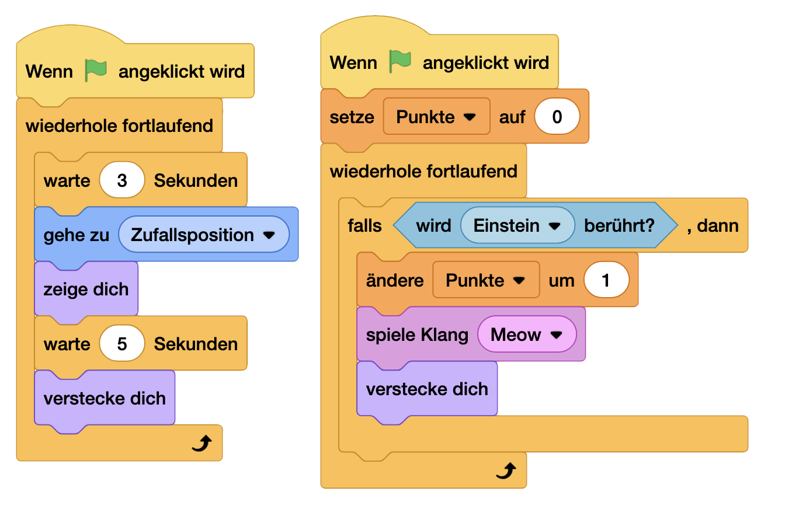

# Katzen Freund 😺 [⭐]

### NerdY Fun-Fact

Wusstest du? Der erste digitale Staubsauger-Roboter wurde 2002 eingeführt. Katzen auf der ganzen Welt haben seitdem einen neuen Erzfeind - oder ein neues Transportmittel! 🤖

### Was du hier lernst

- Steuerung mit Pfeiltasten programmieren
- Kollisionen erkennen und darauf reagieren
- Punkte sammeln und zählen
- Mit Zufallspositionen arbeiten

## Kater Einstein vs. Evil-Staubsauger

Kater Einstein, das klügste Haustier der Stadt, muss vor einem durchgedrehten Saugroboter fliehen. Sammle Wollknäule für Extra-Power!

So programmierst du es:

Figuren einrichten:

1. Kater Einstein (deine Pixel-Katze)
2. Saugroboter (runde Form, böse Augen)
3. Quietsche-Maus (Power-Ups)

### Für Kater Einstein:

### Für den Saugroboter:

### Für die Quietsche-Maus:

### und fertig:

https://scratch.mit.edu/projects/1099494165

### Profi-Tricks 🎓

1. Smooth Movement
   - Kleinere Schritte für flüssigere Bewegung
   - Beschleunigung einbauen
   - Prelle von Rand ab
2. Cleverer Staubsauger
   - Verschiedene Bewegungsmuster
   - Geschwindigkeit erhöhen mit Zeit
   - "Wütend" werden bei Punkten
3. Power-Up System
   - Verschiedene Power-Up Typen
   - Zeitlich begrenzte Effekte
   - Combo-System

## Challenges  🎯

- [ ] Füge einen Timer hinzu
- [ ] Mache den Staubsauger schneller

## Checkliste

- [ ] Du kannst die Katze bewegen
- [ ] Die Maus landet im Magen des Katers und verschwindet
- [ ] Der Roboter ist viel zu schnell und du schaffst es trotzdem 5 Mäuse zu fressen
- [ ] Die Katze verschwindet im Off und du kannst sie nicht mehr sehen, wie krieg ich die wieder her? 

## nerdY weiß:
Die Bilder für dieses Handbuch haben wir mit ChatGPT und Dall-E erzeugt. Du kannst deine Bilder selber malen, pixeln oder natürlich auch mit einer KI erzeugen!
