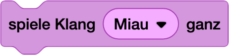
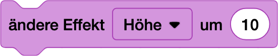

# Sound Master 🎵 [⭐⭐]

> [!TIP]
> ### NerdY Fun-Fact 🤓
> Wusstest du? Das "Jump"-Geräusch von Super Mario wurde 1985 erfunden, weil der Komponist keine Melodie mehr unterbringen konnte - heute ist es eines der bekanntesten Soundeffekte der Welt! 🎮
>

### Was du hier lernst

- Soundeffekte in dein Spiel einbauen
- Töne mit Aktionen synchronisieren
- Mit Lautstärke und Effekten experimentieren
- Audio-Feedback für Spielereignisse

## Sound-Effects 

Dirigiere deine eigene Spiele-Symphonie! Erschaffe dynamische Soundeffekte, die dein Spiel zum Leben erwecken.

Mit diesem Block kannst du Töne und Musik abspielen:

Deine Aufgaben:

- Füge den Block beim Programm von Einstein hinzu:
  - `Falls wird **Quietsche Maus** berührt` 
  - Orientiere dich am Code des Staubsaugerroboters
  - `spiele Klang Miau` wenn er sich eine Maus schnappt.

> [!WARNING]
> ## NerdY Pannenhilfe 🚑 
> Obacht - es gibt 2 `spiele Klang`-Befehl:
> 
> - Der `spiele Klang`-Befehl startet das Abspielen, aber das Programm läuft weiter.
> - Der `spiele Klang ... ganz` wartet an dies Stelle solange, bis der ganze Klang gespielt ist, erst dann läuft der rest des Programmes weiter.

> [!IMPORTANT]
>  # NerdY Side Quests 🎮
> - [ ] Füge den Block `ändere Effekt` hinzu, wenn man auf Einstein klickt. Was passiert? Klicke ganz oft drauf!
>   
> - [ ] Mache eine `wiederhole 10 mal` um den Ton-Effekt 
> - [ ] Bitte schau dir mal dieses Projekt an - es ist von EricR, einem der Master-Minds hinter Scratch, ich liebe es:
>   https://scratch.mit.edu/projects/537008383/

---