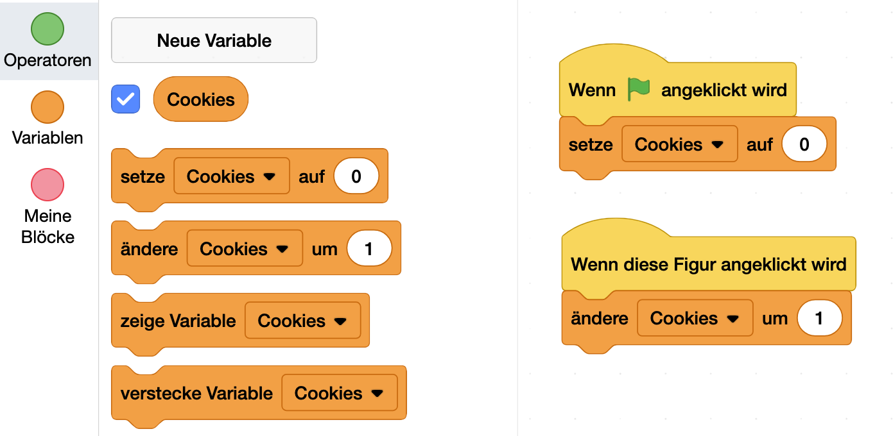
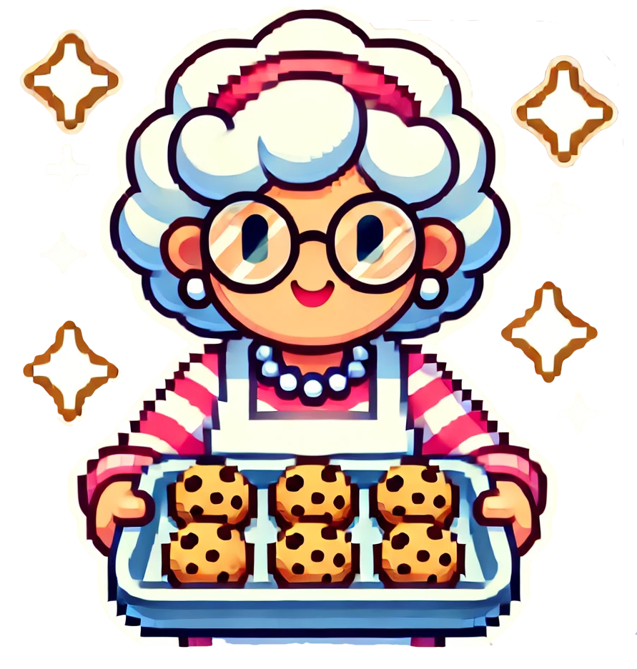
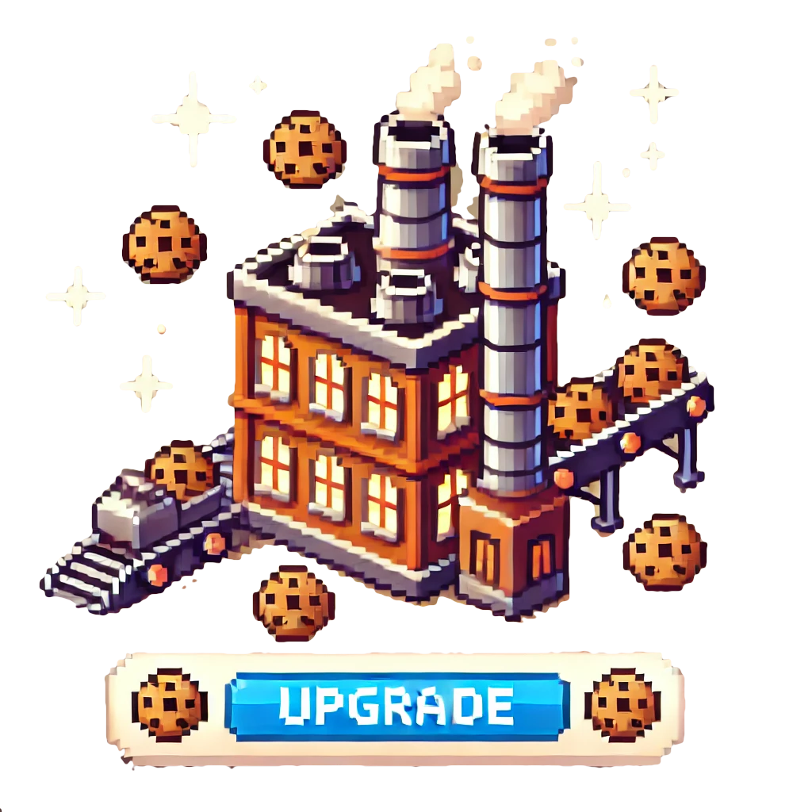
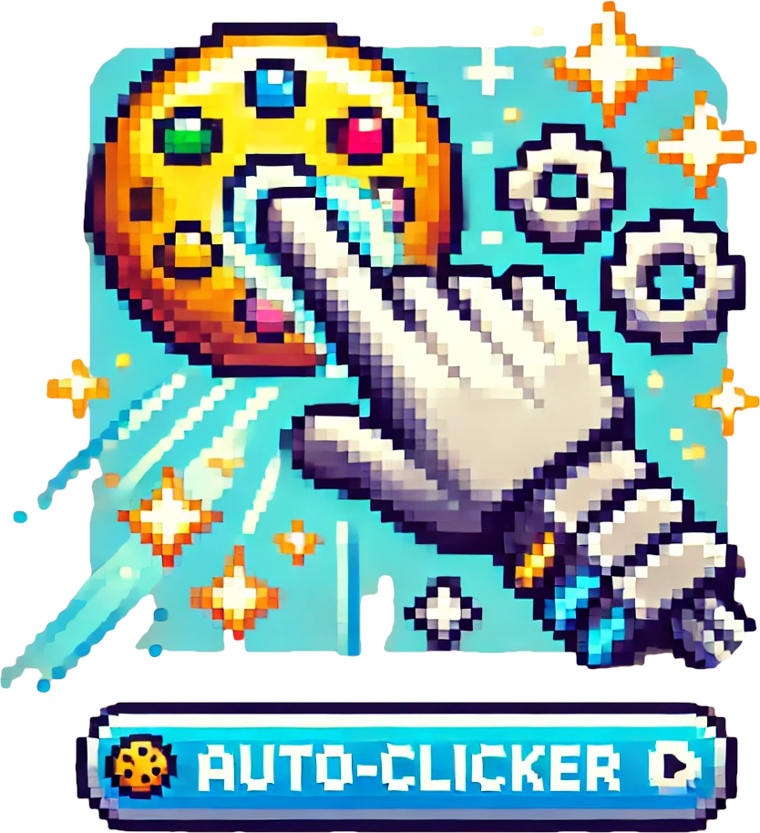
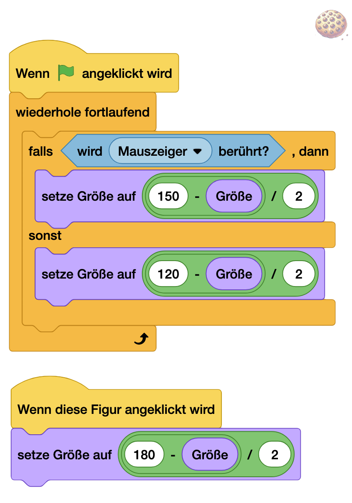

# Cookie King 🍪 [⭐⭐]
## Mmh, Kekse! 

Wer kann dem Duft von frisch gebackenen **Keksen** widerstehen? Und auch der **Cookie-Clicker** erfreut sich großer Beliebtheit. Wie den **Keksen** gehts auch bei **Spielen** um das ganze **Erlebnis**: **Riechen**, **Sehen**, **Schmecken**!

> [!TIP]
>
> **NerdY Fun-Fact**
>
> Der originale **Cookie Clicker** wurde **2013** von einem französischen **Programmierer** in seiner Mittagspause entwickelt - heute haben über **4 Millionen Menschen** mehr als **1 Trillion virtuelle Kekse** gebacken! 🏭 Das originale **Spiel** findest du hier: https://orteil.dashnet.org/cookieclicker/ 

### Was du hier lernst 🎯

- Ein süchtig machendes **Idle-Game** entwickeln
- Mit **Variablen** rechnen und Werte speichern
- **Klick-Ereignisse** programmieren
- Automatische **Aktionen** durch **Schleifen**
- Ein **Upgrade-System** aufbauen
- **Spiel-Balance** gestalten

## Der Keks!

Lege dir eine neue **Figur** an - der **Keks**!

Du kannst: 

- Eine bestehende `Figur wählen`
- eine neue `Malen`
- oder eine mit **ChatGPT** erzeugen und die `Figur hochladen`

## Die Variablen!

> [!NOTE]
>
> **Nerdy-Erkläromat: Var-I-Was?**
>
> Eine **Variable** ist wie eine beschriftete **Box**, in der du Dinge aufbewahren kannst. Stell dir vor, du hast mehrere **Kisten**:
> 1. Eine **Box** mit der Aufschrift "**Punkte**" - hier speicherst du deinen **Spielstand**
>
> 2. Eine **Box** mit "**Leben**" - hier merkst du dir, wie viele **Leben** noch übrig sind
>
> 3. Eine **Box** "**Name**" - hier steht der **Name** deines **Charakters** drin
>    Das Besondere an diesen **Boxen** ist:
>
> 4. Du kannst jederzeit reinschauen, was drin ist
>
> 5. Du kannst den **Inhalt** ändern
>
> 6. Du kannst mit dem Inhalt rechnen (bei Zahlen)
>
> 7. Du kannst den Inhalt für verschiedene Dinge im Spiel verwenden

## .. und so zählt dein Cookie hoch

- Erstelle eine neue Variable: clicke auf `Neue Variable`
- Nenne die Variable "Cookies"
- Beim Stard des Programms - `setze Cookies auf 0` - des Spiel geht ja immer von 0 los.
- Wenn der Cookie angeklickt wird - `ändere Cookies um 1` -  das erhört die Variable Cookies jeweils um eins.

## Das Upgrade-System

Jetzt fehlen nur noch die Upgrades - wie genau Du sie programmierst, findest du heraus, wenn du die QR-Code scannst!

| Back-Oma                               | Bäckerei                                           | Auto-Klicker                             | Erklärung                                                |
| -------------------------------------- | -------------------------------------------------- | ---------------------------------------- | -------------------------------------------------------- |
|  |  |  | https://pad.kidslab.de/p/GamesLab-CookieMaster (QR Code) |

> [!IMPORTANT]
>
> **NerdY Side Quests: Knusprige Animation!**
>
> Ein Spiel lebt ja auch davon, dass es sich gut "anfühlt" - also es beim Klicken Effekte gibt!
>
> Probiere diesen Code mal bei deinem Spiel aus!  
>
> **Du musst die Werte bei Größe entsprechend deinem Cookie anpassen, also die Zahlen: 150, 120 und 180.** 
>
> { width=50% }

**Remember**: Der beste Cookie Clicker ist der, den man nicht mehr aufhören kann zu spielen! 🍪✨

\newpage