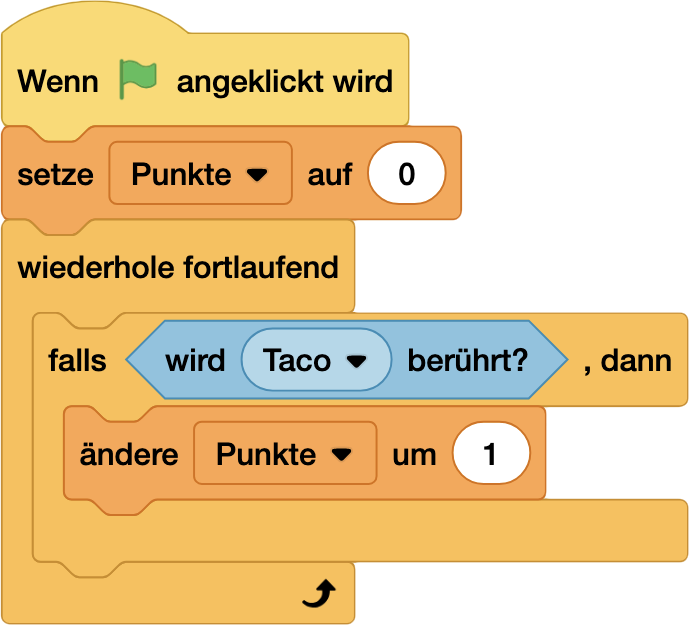
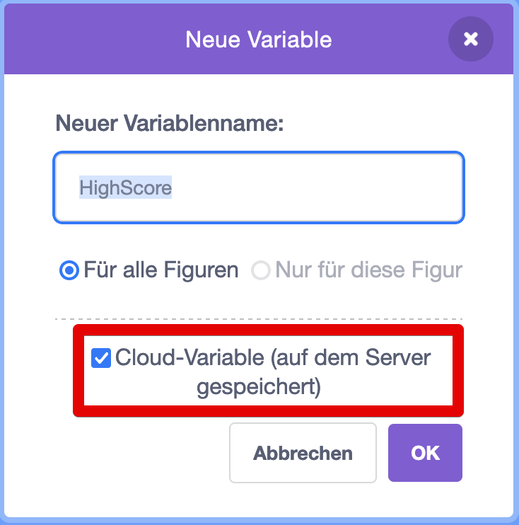
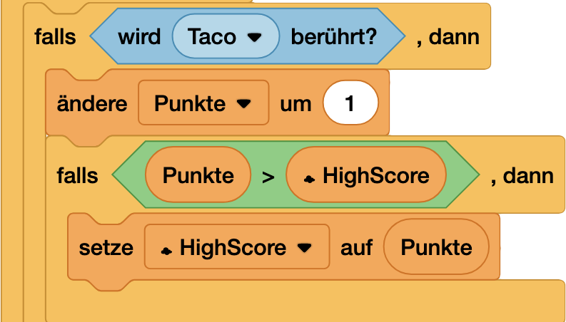

# Level 6 - High-Score Master 🏆 [⭐⭐⭐]
### Für die Ewigkeit! Speichere die besten Leistungen

> [!TIP]
>
> **NerdY Fun-Fact**
>
> Der erste dokumentierte **High-Score** der Videospielgeschichte wurde **1976** im Spiel **Sea Wolf** aufgestellt. Damals musste man noch ein **Foto** vom Bildschirm machen, um seinen **Score** zu beweisen! 📸

### Was du hier lernst 

- Ein **Highscore-System** entwickeln
- Mit **Cloud-Variablen** arbeiten
- **Daten** dauerhaft speichern
- Eine **Bestenliste** programmieren
- Mit dem **Scratch Community-System** interagieren

## Teil 1: Die Basics

### Punkte sammeln

Punkte haben wir bisher ja auch schon gesammelt - dafür nimmst du eine **Variable**!

{ width=50% }

- Am Anfang: `setze Punkte auf 0`
- Wenn die **Katze** den leckeren `Tako` berührt...
- ... dann `ändere Punkte um 1`

### Punkte speichern

Jedesmal, wenn du dein **Spiel** neu lädst, sind ja alle **Variablen** zurückgesetzt. Zum **Speichern** gibt es eine erweiterte **Variablen-Art**, die `Cloud-Variable`. 

{ width=30% }

Einfach prüfen, ob der aktuelle **Punktestand** größer als der **Highscore** ist - falls ja: dann ist ein neuer **Highscore** erreicht!

{ width=50% }

> [!WARNING]
>
> **NerdY Pannenhilfe 🚑**
>
> Um **Cloud-Variablen** benutzen zu können, musst du ein "Verifizierter" **Scratcher** sein. Mit einem neuen Konto bist du erst mal nur ein **NPC** - du musst dir den Status als echter **Scratcher** erst verdienen. Dazu musst du:
>
> - aktiv auf **Scratch** sein
> - **Projekte** veröffentlichen
> - Andere **Projekte** kommentieren und liken
>
>  Das geschieht nach frühestens zwei Wochen durch einen Link (*Become a Scratcher*) auf der Profilseite hinter dem Profilbild.
>
> Warum? Mit **Cloud-Variablen** kann man Blödsinn anstellen. Mehr Infos findest du hier: https://de.scratch-wiki.info/wiki/R%C3%A4nge

## Teil 2: Pimp my Highscore!

Aber da geht noch mehr:

- **Top 5 Liste**
- **Namenseingabe**
- **Datum & Uhrzeit**

### Entdecke mehr! 📱

Wie der 2. Teil genau geht, findest du hier:

\newpage