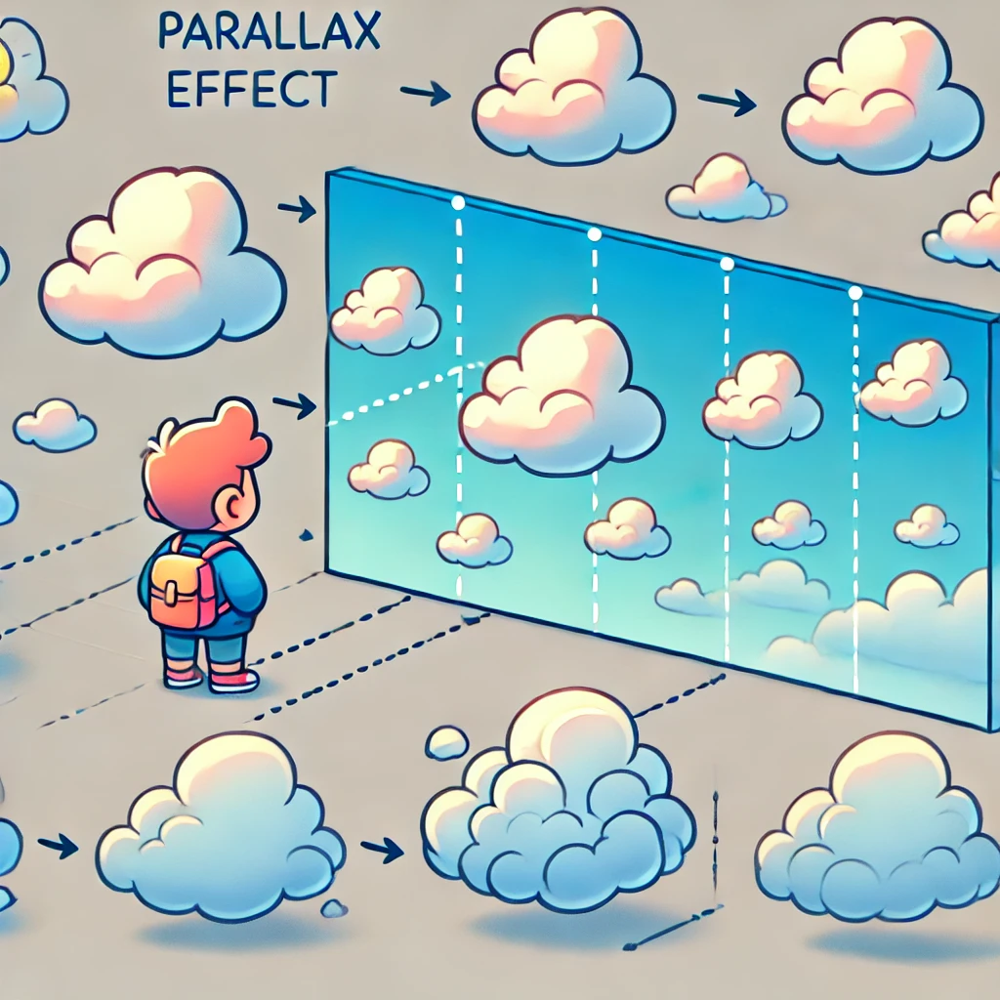
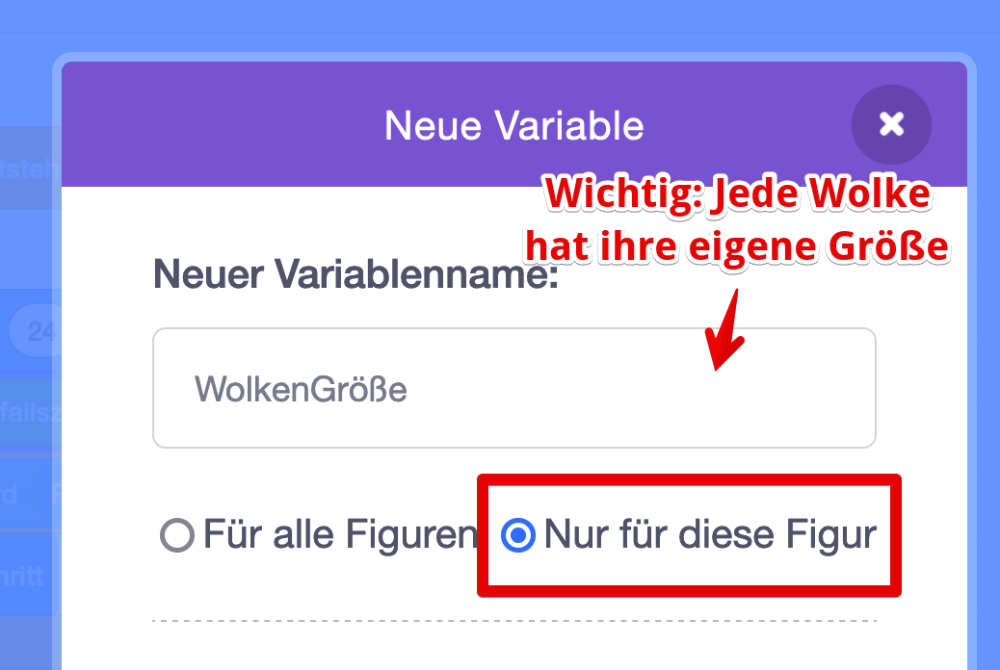
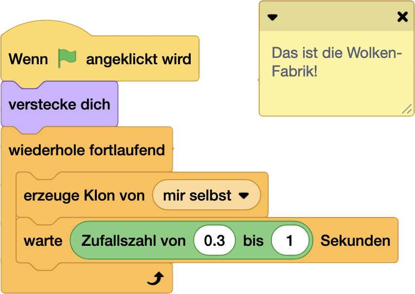
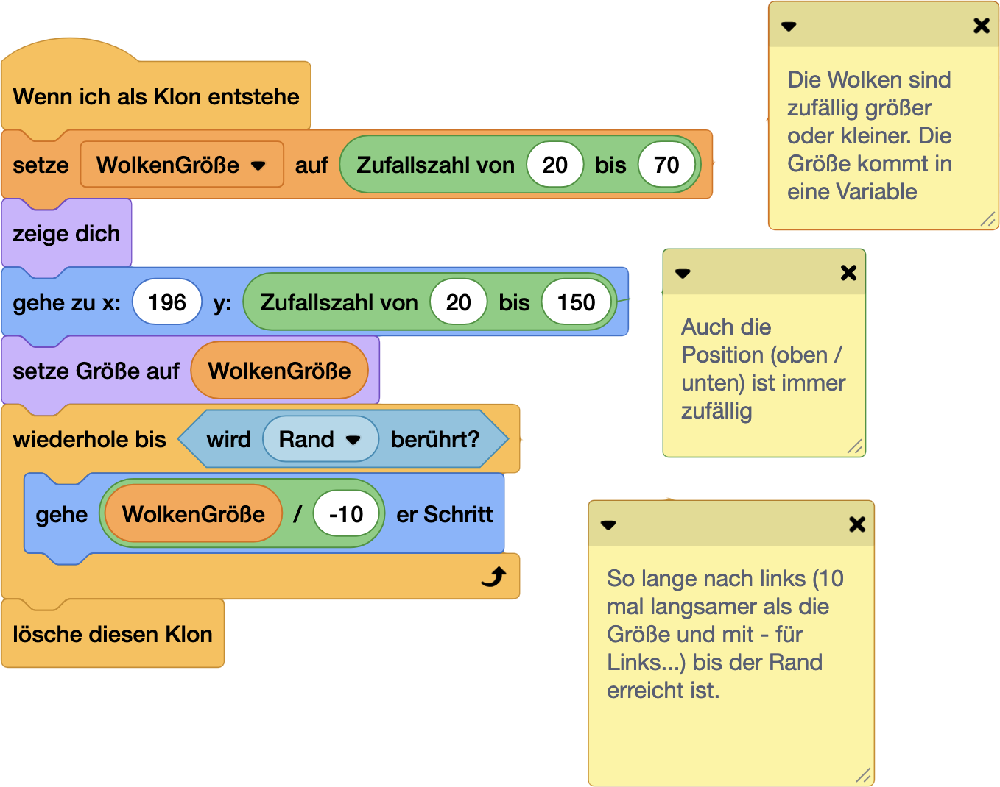
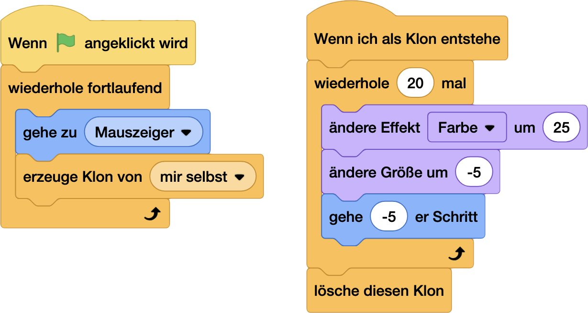
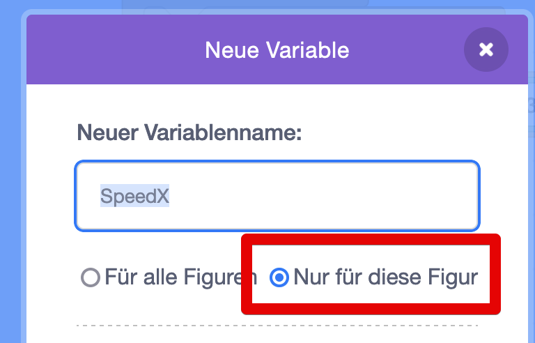
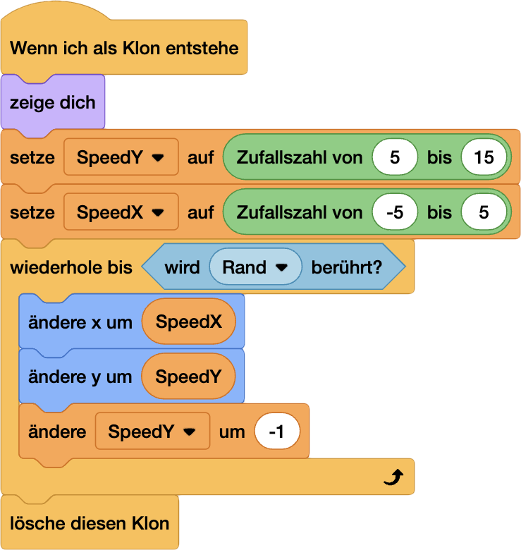

# Effect Wizard ✨ [⭐⭐⭐⭐]
Abrakadabra! Zaubere magische Effekte in dein Spiel und lass es in neuem Glanz erstrahlen.

### NerdY Fun-Fact
Die berühmten Partikeleffekte in Mario Kart entstanden ursprünglich durch einen Bug - die Entwickler fanden sie aber so cool, dass sie sie im Spiel gelassen haben! 🏎️✨

---

# Effekte-Spotlight: Paralax-Effekt!

Schnapp dir dein Dino-Spiel - wir pimpen es mal ein bisschen auf! Mit dem Paralax-Effekt!

# Wie funktioniert das?

### Dinge im Hintergrund: 
- bewegen sich langsamer
- sind kleiner

### Dinge weiter vorne:
- bewegen sich schneller
- sind größer

### So gehts:

 [alt text](08-EffectWizard.md)

(Beispielprojekt - QR Code? https://scratch.mit.edu/projects/1103943291/)

---

# Regenbogen-Power 🌈

Mit diesem Effekt kannst du einer Figur einen Regenbogen-Schweif verleihen, wie ein Komet! 

Eignet sich super für Super-Power, Power-Ups oder Unverwundbarkeit.

Und wieder sind die Klone am Start!

Beispiel: https://scratch.mit.edu/projects/1103963666/

# Sparkle! Lass die Funken fliegen!

Noch ein kleiner feiner Effekt zum Abschluss - eignet sich hervorragend alse Game-Over oder Gewonnen-Effekt!

Ach ja, wieder mal arbeiten wir mit Klonen! Nur gut, dass wir genug Klone haben :-)

- Mach dir eine neue Figur - die werden dann zu deinen Funken oder Partikeln.

## Die Klon-Muddi

Als erstes wieder unsere Fabrik: 

- wenn der Effekt getriggert wird (bei mir mit der Leertaste)
- Geh zur Figur oder Stelle, wie es funkelt
- erzeug ganz viele Klone...

## ... und die Kids!

- Erstelle 2 lokale Variable:
  - `SpeedX` - wie schnell gehts links und rechts.
  - `SpeedY` - hoch und runter!
- `SpeedX` und `SpeedY` kriegen zufällige Werte - es soll ja immer ein bisschen anders aussehen.
- Die Y-Bewegung (hoch und runter)kennst du schon vom Dino - erst gehts hoch, aber wir zählen die Bewegung immer weiter runter... 
- ... und am Rand ist Schluss mit dem fröhlichen Klon-Leben: `lösche diesen Klon`

> [!NOTE]
>
> **Schlau-Nerdy erklärt:** <u>Was sind lokale und globale Variablen?</u>
>
> *Sind das vielleich Variablen aus deiner Region, die dann extra frisch? Weit gefehlt!*
>
> Wenn du eine Variable erstellst, können alle Figuren darauf zugreifen und auch den Inhalt ändern. So kannst du zum Beispiel super Infos zwischen Figuren teilen. Programmierer nennen solche Variablen `global`.
>
> Für uns bestimmen die beiden Variablen SpeedX und SpeedY die bewegung jeden einzelnen Funkens. 
>
> Jeder soll sich anders bewegen, der eine links, der andere rechts, schneller und langsamer. Hier brauchen wir `lokale` Variable. 
>
> 

 

Mögen deine Effekte magisch sein! ✨🎮

Remember: Mit großer Effekt-Power kommt große Verantwortung! 🧙

Weitere Effekte und wie sie funktionieren findest du hier: 
## QR Code: https://pad.kidslab.de/GamesLab-Effekte#

---

