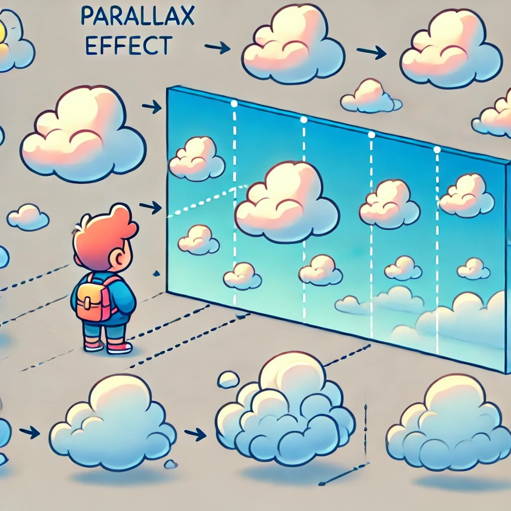

# Level 7- Effect Wizard ✨ [⭐⭐⭐⭐]
Abrakadabra! Zaubere magische **Effekte** in dein Spiel und lass es in neuem Glanz erstrahlen.

> [!TIP]
>
> **NerdY Fun-Fact**
>
> Die berühmten **Partikeleffekte** in Mario Kart entstanden ursprünglich durch einen **Bug** - die Entwickler fanden sie aber so cool, dass sie sie im Spiel gelassen haben! 🏎️✨

### Was du hier lernst 

- **Visuelle Effekte** in deine Spiele einbauen
- **Partikel-Systeme** mit Klonen erstellen
- Mit **Bewegungs-** und **Grafikeffekten** arbeiten
- **Animationen** und **Übergänge** programmieren

## Parallax-Effekt!

Schnapp dir dein **Dino-Spiel** - wir pimpen es mal ein bisschen auf! Mit dem **Parallax-Effekt**!

### Wie funktioniert das?

### Dinge im Hintergrund: 
- bewegen sich **langsamer**
- sind **kleiner**

### Dinge weiter vorne:
- bewegen sich **schneller**
- sind **größer**

{ width=50% }

### So gehts:

{ width=33% }

{ width=50% } 

{ width=50% }

\newpage

## Regenbogen-Power 🌈

Mit diesem **Effekt** kannst du einer **Figur** einen Regenbogen-Schweif verleihen, wie ein Komet! 

Das eignet sich super für **Super-Power**, **Power-Ups** oder **Unverwundbarkeit**.

Und wieder sind die **Klonen** am Start!

{ width=50% }

## Sparkle! Lass die Funken fliegen!

Noch ein kleiner, feiner **Effekt** zum Abschluss - eignet sich hervorragend als **Game-Over** oder **Gewonnen-Effekt**!

Ach ja, wieder mal arbeiten wir mit **Klonen**! Nur gut, dass wir genug **Klonen** haben :-)

- Mach dir eine neue **Figur** - die wird dann zu deinen **Funken** oder **Partikeln**.

### Die **Klon-Muddi**

Als erstes wieder unsere **Fabrik**: 

- wenn der **Effekt** getriggert wird (bei mir mit der Leertaste)
- Geh zur **Figur** oder Stelle, wo es funkelt
- erzeug ganz viele **Klonen**...

{ width=50% }

### ... und die **Kids!**

- Erstelle 2 lokale **Variablen**:
  - `SpeedX` - wie schnell geht’s links und rechts.
  - `SpeedY` - hoch und runter!
- `SpeedX` und `SpeedY` kriegen zufällige Werte - es soll ja immer ein bisschen anders aussehen.
- Die Y-Bewegung (hoch und runter) kennst du schon vom **Dino** - erst geht’s hoch, aber wir zählen die Bewegung immer weiter runter... 
- ... und am Rand ist Schluss mit dem fröhlichen **Klon-Leben**: `lösche diesen Klon`

> [!NOTE]
>
> **Nerdy Erkläromat:** <u>Was sind lokale und globale Variablen?</u>
>
> *Sind das vielleicht **Variablen** aus deiner Region, die dann extra frisch sind? Weit gefehlt!*
>
> Wenn du eine **Variable** erstellst, können alle **Figuren** darauf zugreifen und auch den Inhalt ändern. So kannst du zum Beispiel super Infos zwischen **Figuren** teilen. Programmierer nennen solche **Variablen** `global`.
>
> Für uns bestimmen die beiden **Variablen** `SpeedX` und `SpeedY` die Bewegung jedes einzelnen Funkens. 
>
> Jeder soll sich anders bewegen, der eine links, der andere rechts, schneller und langsamer. Hier brauchen wir `lokale` **Variablen**. 
>
> { width=25% }

{ width=50% }

Mögen deine **Effekte** magisch sein! ✨🎮

**Remember:** Mit großer **Effekt-Power** kommt große **Verantwortung**! 🧙

### Entdecke mehr! 📱

Weitere **Effekte** und wie sie funktionieren findest du hier: 

\newpage