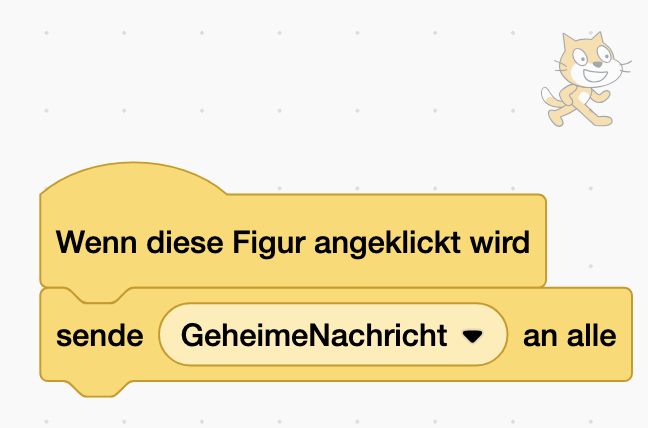
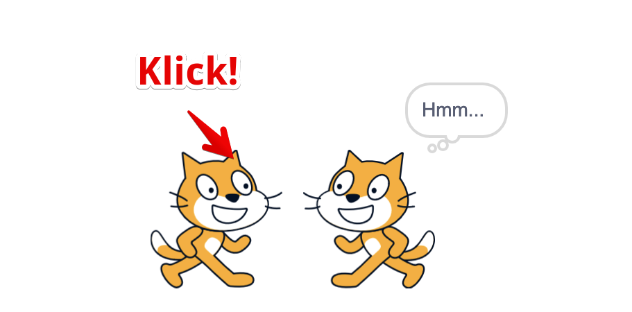
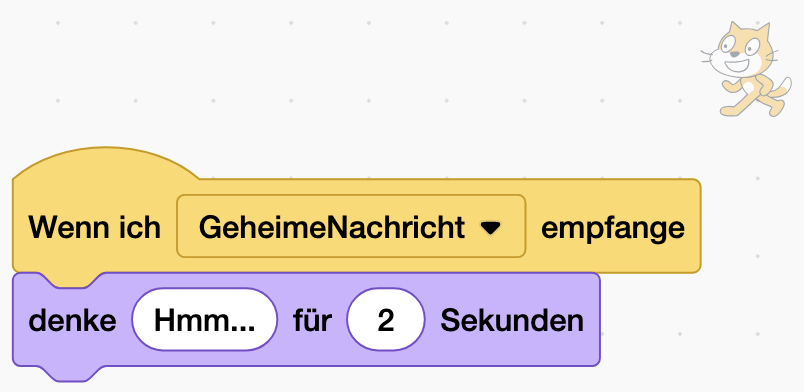

# Intro Designer 🎬 [⭐⭐⭐⭐]
Der erste Eindruck zählt! Kreiere ein packendes Intro und einen dramatischen Game-Over-Screen.

## Der erste Eindruck zählt!

> [!TIP]
>
> ### NerdY Fun-Fact
>
> Das erste Videospiel-Intro überhaupt war eine simple Animation im Spiel "Space Invaders" (1978) - die außerirdischen Invasoren marschierten von oben nach unten ins Bild! Space Invader ist so berühmt, dass es sogar sein eigenes Emojy hat 
>
> # 👾

### Was du hier lernst
- Ein packendes Intro für dein Spiel erstellen
- Dramatische Game-Over Screens designen  
- Text-Effekte und Animationen
- Sound und Musik wirkungsvoll einsetzen
- Wie du mit `Nachrichten` zwischen den Figuren kommunizieren kannst 

> [!NOTE]
>
> ### Nerdy-Erkläromat: Nachrichten senden und empfangen
>
> Für das Intro, Game-Over etc. müssen wir die einzelnen Figuren im Scratch miteinander "verdrahten". Das heißt, wenn zum Beispiel der Dino mit dem Katkus zusammesstösst, müssen auch die Steine und die Wolken wissen, dass jetzt "Game Over" ist.
>
> Mit den Nachrichten können die Figuren sozusagen Gedankenübertragen:
>
> |  |  |  |
>| ----------------------------------------------------------- | ------------------------------------------------- | ------------------------------------------------------------ |
> 
> Das nutzen wir auch, um den Figuren unseres Spiel mitzuteilen, dass jetzt Zeit für ihren Auftritt ist. Oder eben Schluss: Game Over!

### Teil 1: Das Intro
#### So fesselst du deine Spieler von Anfang an

**Der große Auftritt: Titel-Animation**

- Trick: Lass deinen Spieltitel nicht einfach erscheinen - bring ihn in Bewegung!
- Arbeite mit Farb- und Größenänderungen

### Teil 2: Game Over mit Stil
#### Aus Spielende mach Spielerlebnis

1. **Der dramatische Abgang**
   - Zeitlupe-Effekt beim letzten Leben
   - Screen-Shake beim Game Over
   - Dramatische Musik oder Sound-Effekte

2. **Der Neustart-Hook**
   - Motivierende Nachricht
   - "Noch ein Versuch?"-Button mit Animation
   - Tipp: Ein schneller Neustart hält die Spieler bei der Stange!
   

Wie das alles geht, erfährst Du hier:

https://pad.kidslab.de/p/GamesLab-Intro (QR Code)

---
