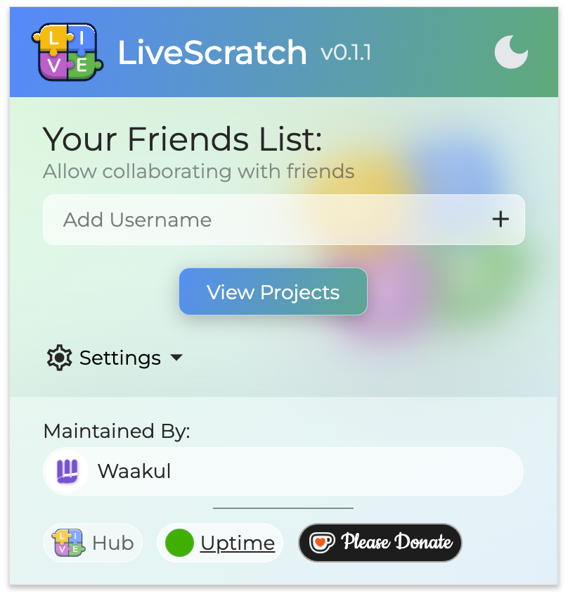

# Extension King 🧩 [⭐⭐⭐⭐]
Bereit für die geheimen Superkräfte von Scratch? Mit TurboWarp, Erweiterungen und Add-ons holst du noch mehr Power aus deinen Spielen raus. 

> [!TIP]
>
> ### NerdY Fun-Facts 💡🤓
>
> Wusstest du? Der TurboWarp Compiler wurde von einem Teenager entwickelt, der Scratch schneller machen wollte - heute nutzen Millionen von Scratchern seine Erfindung!

### Was du hier lernst 🎯

- Scratch mit TurboWarp beschleunigen
- Coole Erweiterungen nutzen
- Deine Spiele als echte Programme exportieren
- Mit anderen zusammen programmieren

## TurboWarp (https://turbowarp.org/)

TurboWarp ist wie ein Power-Booster für deine Scratch-Projekte! Es ist eine spezielle Version von Scratch, die deine Spiele und Animationen bis zu 10x schneller macht. 

### Extensions (Erweiterungen):
TurboWarp hat eine ganze Menge zusätzlicher Erweiterungen, die du im normalen Scratch nicht findest. Das ist wie ein riesiger Werkzeugkasten mit Extra-Werkzeugen! Damit kannst du zum Beispiel:

- Neue Effekte einbauen
- Bessere Physik für deine Spiele nutzen
- 3D-Grafiken erstellen
- Und vieles mehr!

### Der TurboWarp Packager:
Das ist wie ein magischer Verpackungsroboter für deine Projekte! Er verwandelt dein Scratch-Projekt in eine richtige, eigenständige App oder Programm. 

## Scratch Addons (https://scratchaddons.com/de/)

Die Browser-Erweiterung von Griffpatch macht Scratch besser und praktischer. Sie bringt viele nützliche Features:

- Besserer Code-Editor
- Einfachere Code-Bearbeitung und Fehlersuche
- Praktische Extras wie Vollbildmodus und Gamepad-Unterstützung
- Die Erweiterung findest du im Browser-Store (Chrome, Firefox etc.) unter dem Namen "Scratch Addons".

## BlockLive - Geimeinsam ist besser!

Die "Blocklive" Extension ist ein cooles Tool für Teamarbeit in Scratch!

Installation und Infos: https://pad.kidslab.de/p/GamesLab-LiveScratch (QR code)

## PengiunMod (https://penguinmod.com/)

PengiunMod ist ein aufgemotztes Scratch, es verbindet TurboWarp mit zusätzlichen Features!

\newpage
