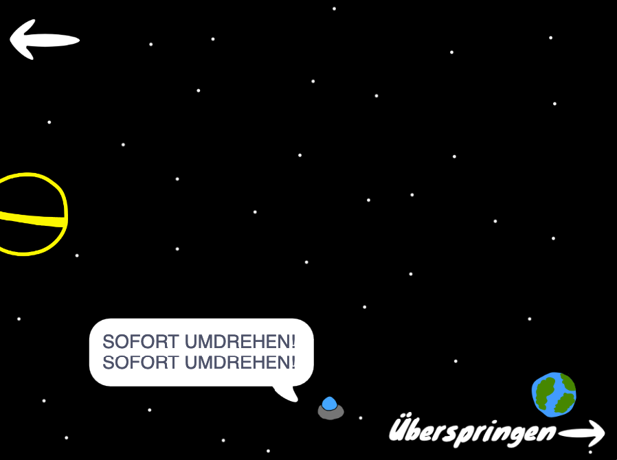
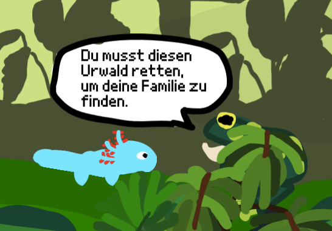
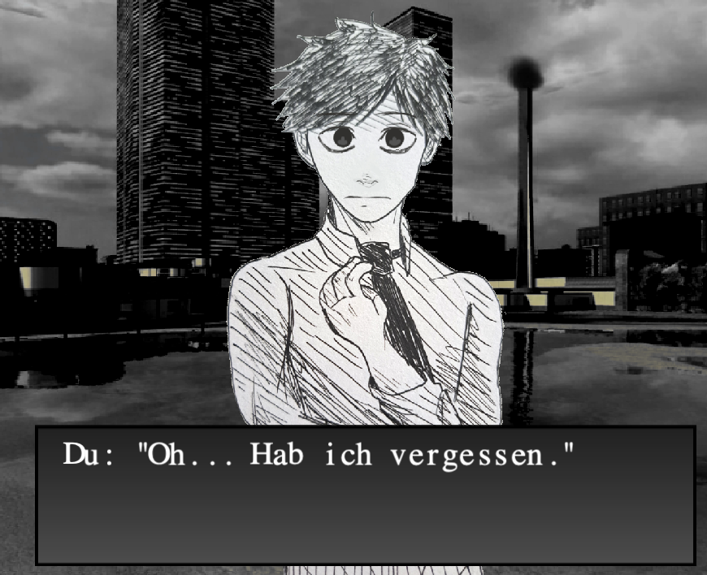

# Game Master 🎮 [⭐⭐⭐⭐⭐]
Das ultimative Ziel! Erschaffe dein Meisterwerk mit allem drum und dran. Du bist jetzt ein echter Game Developer!

## Mein Spiel 🎮 Spielinformationen

**Name deines Spiels:** 

**Genre:** (z.B. Jump'n'Run, Clicker, Quiz, etc.)

**Was ist die Story in deinem Spiel:**

**Mein Spiel erklärt in einem Satz:**

___

### 2\. Spielmechanik

**Der Spieler kann:**

- □ _\_  
- □ _\_  
- □ _\_

**Steuerung:**

Mit diesen Tasten / Maus etc. kann man im Spiel laufen, springen, schießen etc.:

______

- ____

**Punktesystem:** 

So bekommt man Punkte: \_\_\_\_\_\_\_\_\_\_\_\_\_\_\_\_\_\_\_\_\_\_\_\_\_\_ 

So verliert man: _\_\_\_\_

### 3\. Die Hauptfigur(en)

So heißt meine Hauptfigur / das ist meine Hauptfigur:

Eine Zeichnung oder Beschreibung meiner Hauptfigur(en):

\[Platz zum Zeichnen\]

**Besondere Fähigkeiten meiner Figur(en):**

- ________

- ______

### 4\. Level

**Schwierigkeitsgrad meines Spiels:** □ Leicht  □ Mittel  □ Schwer

**Das macht mein Spiel besonders spannend:**

- ______
- ______
- ___
**Level/Abschnitte:**

1. ___

2. ___

3. ___

### 5\. Grafik & Sound

**In diesem Art-Style ist mein Spiel gestaltet:** □ Pixel  □ Comic  □ Realistisch  □ Anders: \_\_\_\_\_\_\_\_\_

**Diese Sounds/Musik kommen in meinem Spiel vor:**

- □ Hintergrundmusik: \_\_\_\_\_\_\_\_\_\_\_\_\_\_\_\_  
- □ Effekte für: \_\_\_\_\_\_\_\_\_\_\_\_\_\_\_\_\_\_\_\_\_  
- □ Sonstiges: \_\_\_\_\_\_\_\_\_\_\_\_\_\_\_\_\_\_\_\_\_

### 6\. Extra-Features

**Nice-to-have** (Falls noch Zeit ist):

- □ _\_  
- □ _\_  
- □ _\_

### PRO-TIPPS

- Fang klein an\! Du kannst später immer noch Features hinzufügen  
- Teste früh und oft  
- Lass andere dein Spiel probespielen  
- Speichere regelmäßig Versionen deines Spiels  
- Dokumentiere deinen Code mit Kommentaren  
- 

\newpage

# Der GamesPreis!

Reiche dein Spiel beim GamesPreis ein und gewinne mega krasse Preise!

- Preise

  - Nintendo Switch OLED
  - Meta-Quest 3
  - 3D-Drucker “Bambulab mini”

- **Checkliste zur Einreichung**:

  - Projekt fertiggestellt, veröffentlicht und getestet?
  - Alle Spielbeschreibungen hinzugefügt?
  - Kontaktinformationen angegeben?

### Dann nichts wie los:

### 

https://kidslab.de/gamespreis/

\newpage

# Der GamesPreis 2024

**Verleihung des 1. Augsburger GamesPreis im Kleinen Goldenen Saal**

Augsburg, 24. April 2024

Im Kleinen Goldenen Saal in Augsburg ist die Aufregung unter den jungen  Augsburger Nachwuchs-Programmierern sowie deren Familien und Freunden  deutlich zu spüren. Denn es geht um nichts Geringeres als um die  Verleihung des 1. Augsburger Games-Preises, der von der gemeinnützigen  KidsLab GmbH ins Leben gerufen wurde. 

Die Games-Preis-Gala ist  dabei der Höhepunkt des Augsburger GamesLab, dem kreativen  Spiele-Studio, das Anfang des Jahres in der Augsburger “Zwischenzeit”  stattgefunden hat (die AZ berichtete). Kinder und Jugendliche wurden  dort kostenlos in die Welt der Spieleprogrammierung mit Scratch  eingeführt, um fortan eigene Spielideen verwirklichen zu können. 

Und das, was die jungen Bewerber des GamesPreis an selbst entwickelten  Spielen eingereicht hatten, beeindruckte die Geschäftsführer der KidsLab gGmbH Gregor Walter und Regine Scheyer sowie die dreiköpfige Jury  enorm. Auch wenn es schwer fiel, mussten drei Hauptgewinner gefunden  werden. Ausgezeichnet für besonders herausragende Leistungen im Bereich  Spieleentwicklung und -design wurden Johannes Kistler mit dem 1. Platz  für sein Spiel “Gravity Glide”, Dominik Gößler mit dem 2. Platz (“Water  Facility”) und Tonia Krüger mit dem 3. Platz (“Immerson 2009”). 

Die sichtlich stolzen Gewinner freuten sich über ihre Pokale und die von  AUFWIND, die Kinder und Jugendstiftung der Stadtsparkasse Augsburg,  gespendeten, hochwertigen Preise (Steam Deck OLED, Meta Quest 2  VR-Brille sowie Wacom Grafik-Tablett). Aufgrund der durchweg positiven  Resonanz steht für die Macher des GamesLab bereits jetzt fest, dass das  Projekt nächstes Jahr in die 2. Runde gehen wird.

\newpage

## Die 3 Hauptgewinner 2024:

### 1. Platz - Gravity Glide

In diesem fesselnden Videospiel schlüpft ihr in die Rolle eines UFO-Piloten und tretet eine epische Reise an, in der ihr durch die Manipulation von Planeten und ihrer Gravitation euer Ziel erreichen müsst. Doch das ist noch nicht alles! Strategisch platzierte Planeten und geschickte Nutzung ihrer Gravitationskräfte sind der Schlüssel, um euer UFO sicher durch jedes Level zu manövrieren. Herzlichen Glückwunsch und weiterhin viel Erfolg auf euren Reisen durch die unendlichen Weiten des Spieleuniversums!

{ width=25% }

### 2. Platz - Water Facility

Lasst uns also einen tosenden Applaus für dieses mutige Axolotl und sein inspirierendes Abenteuer entfachen! Möge euer Kampfgeist euch stets leiten und euch den Weg zum Sieg ebnen.

Auf zu neuen Herausforderungen und möge die Flamme der Hoffnung niemals erlöschen!

https://scratch.mit.edu/projects/966666194 (QR Code)

{ width=25% }

### 3. Platz - Imersion 2009 

Taucht ein in die düstere Welt von 'Immersion 2009', einem visuellen Roman und Thriller, der euch auf eine fesselnde Reise durch Intrigen und Mysterien entführt. Begibt euch auf die Suche nach der Wahrheit und erlebt ein Abenteuer, das euch noch lange in Erinnerung bleiben wird!"

https://scratch.mit.edu/projects/964668818

{ width=25% }

\newpage
