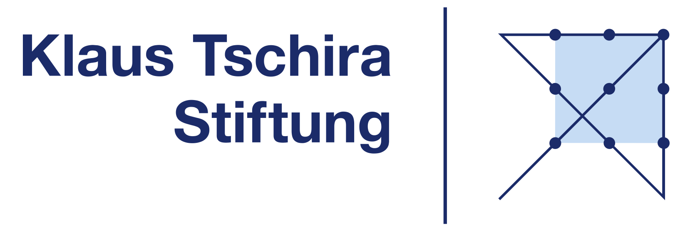
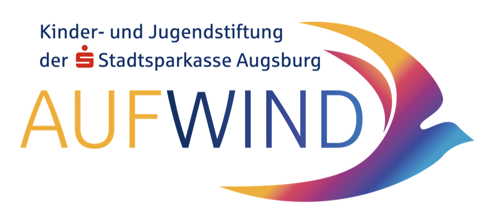

# Danke! 🎮
Wow, du hast es geschafft! Du bist jetzt offiziell ein Game Developer und hast alle Level des GamesLab-Handbuches gemeistert. Das ist echt cool!
Ein großes Dankeschön! 🌟
Dieses Handbuch und das GamesLab wären nicht möglich ohne die Unterstützung von vielen engagierten Menschen und Organisationen:

- An alle Sponsoren, die an die Kraft von Coding und Kreativität glauben
- An die Schulen und Lehrer, die uns ihre Türen öffnen
- An das GamesLab-Team, das unermüdlich neue Ideen entwickelt
- An alle Mentoren, die ihr Wissen teilen
- Und natürlich an **dich**, weil du mit deiner Begeisterung das GamesLab lebendig machst!

# Lizenz & Weitergabe

**Lizenz** CC BY 4.0 KidsLab

# Danke an unsere Unterstützer! 🌟
Ohne die Hilfe von vielen tollen Menschen und Organisationen wäre das GamesLab nicht möglich. Ein besonders großes Dankeschön geht an:

## Klaus Tschira Stiftung gGmbH

## Stiftung AUFWIND

{ width=50% }

## XITASO GmbH

{ width=50% }

Dieses Handbuch wurde mit ❤️ erstellt von deinem KidsLab-Team
Version 1.0 - 2024
